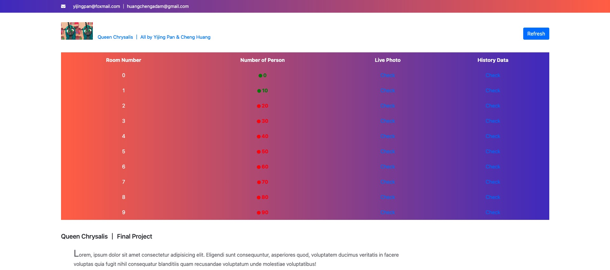
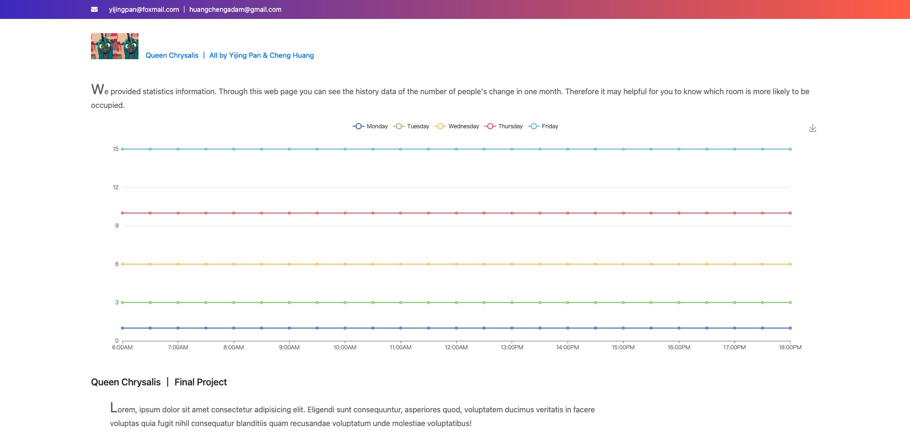

# IoT-Final-Project-Frontend-Flask
( Chinese version below :cn: )  
A demo for developing with **axios Flask and restful api** :smiley:	<br>
This is the IoT exam project frontend part using **HTML CSS JS and Flask**. The frontend use **axios** to get data. Data all mocked from restful api.

## Setup

```
$ pip3 install flask 
$ pip3 install -U flask-cors  
```
It's very important to know that flask-cors only support 


## Axios
```
https://cdn.jsdelivr.net/npm/axios/dist/axios.min.js
```

## Echarts
```
https://cdn.jsdelivr.net/npm/echarts@5.2.1/dist/echarts.js
```
Specific instruction for echarts   https://echarts.apache.org/en/index.html

## Runtime screenshot




<br><br>

# IoT-Final-Project-Frontend-Flask
这是一个通过使用**axios Flask restapi**接口进行开发的demo。 :smiley:	<br>
数据为后端模拟的假数据，开发采用Python中的Flask框架，前端页面通过HTML CSS JS编写。

## 准备工作

```
$ pip3 install flask 
$ pip3 install -U flask-cors  
```
flask-cors 只支持一下python版本，安装时请注意本机的python版本。 


## Axios
```
https://cdn.jsdelivr.net/npm/axios/dist/axios.min.js
```

## Echarts
```
https://cdn.jsdelivr.net/npm/echarts@5.2.1/dist/echarts.js
```
Echarts详细使用说明   https://echarts.apache.org/zh/index.html

## 运行时截图
同上

